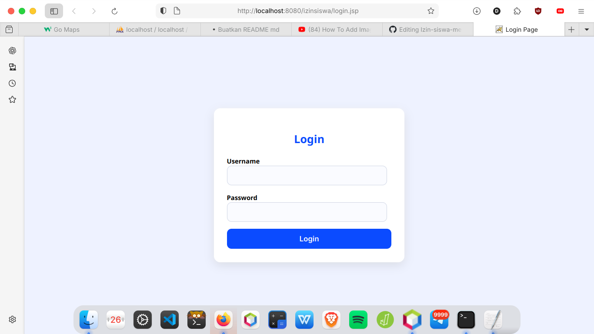

# 🚀 SISTEM INFORMASI IZIN SISWA
### Java JSP & MySQL

Aplikasi **Sistem Informasi Izin Siswa** berbasis **Java JSP dan MySQL** yang digunakan untuk mengelola proses perizinan siswa secara terkomputerisasi.  
Project ini dibuat untuk **keperluan tugas dan pembelajaran**.

---

## 🎯 Fitur Utama
- Login Admin dan Siswa
- 
- Manajemen Data Siswa
- 
- Manajemen Data Guru
- 
- Pengajuan izin siswa
- Persetujuan izin oleh admin
- Status izin (Pending / Disetujui / Ditolak)
- Laporan izin siswa
- Pengaturan akun admin

---

## 🧠 Alur & Logika Aplikasi
1. Admin melakukan login menggunakan username **admin** dan password **admin**.
2. Setelah login, admin masuk ke **dashboard admin**.
3. Admin dapat:
   - Melihat **data izin siswa** yang masuk
   - Menambahkan **data siswa** (NIS dan password digunakan untuk login siswa)
   - Menambahkan **data guru**
   - Mengubah data guru (contoh: mata pelajaran dari Bahasa Indonesia menjadi Bahasa Inggris)
   - Menghapus data guru
4. Admin dapat melihat **laporan izin siswa** melalui menu laporan.
5. Admin dapat mengganti **password admin** melalui menu pengaturan.
6. Admin melakukan logout dan kembali ke halaman login.
7. Siswa melakukan login menggunakan akun yang telah dibuat oleh admin.
8. Pada dashboard siswa, siswa dapat menekan tombol **Ajukan Izin**.
9. Siswa mengisi form pengajuan izin, dan status izin otomatis menjadi **Pending (Menunggu persetujuan admin)**.
10. Admin login kembali dan melihat status izin **Pending** di dashboard admin.
11. Admin masuk ke menu **Data Izin** untuk:
    - Menyetujui (Approve) atau menolak (Reject) izin
    - Melihat bukti izin siswa
12. Setelah izin disetujui, siswa login kembali dan melihat status izin berubah menjadi **Disetujui**.

---

## 🎥 Video Demo Aplikasi
Demo aplikasi dari proses login hingga selesai dapat dilihat melalui link berikut:  
https://youtu.be/VpBcJiZGV88?si=xg8QFmdcC_L6igLF

---

## 🛠️ Teknologi yang Digunakan
- Java JSP
- MySQL
- Apache Tomcat
- NetBeans IDE

---

## 🗄️ Database
**Nama Database:** `db_izin`

**Tabel Utama:**
- `users` (admin)
- `siswa`
- `tbl_guru`
- `izin_siswa`

> Seluruh data yang digunakan merupakan **data dummy** dan hanya digunakan untuk keperluan pembelajaran.

---

## ⚙️ Cara Menjalankan Aplikasi
1. Import database `db_izin.sql` ke **phpMyAdmin**
2. Jalankan project menggunakan **Apache Tomcat**
3. Akses aplikasi melalui browser:http://localhost:8080/izinsiswa

---

## 👨‍💻 Author
Dalpan Rohi

---

## 📄 License
Project ini dibuat dan digunakan untuk **keperluan pembelajaran**.

